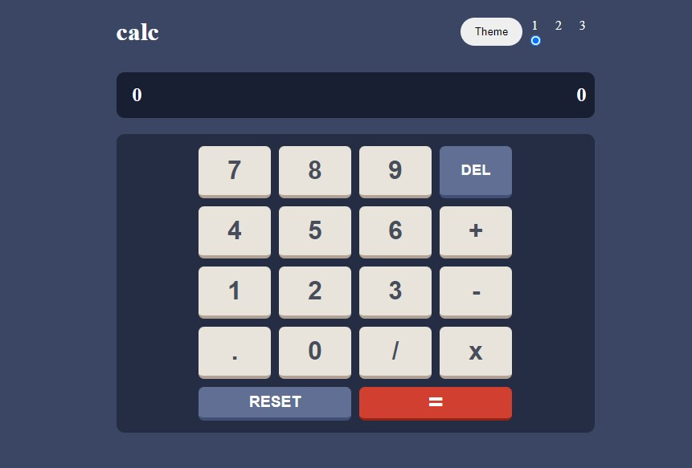

# Calculator app

### Live verzia [Tip calculator app](https://lc-calculator.netlify.app/)

### Ďalšie projekty: [GitHub](https://github.com/ladislav987?tab=stars)

---

## Popis funkcii v app.js:

### **function addNumber(number)**

- pridáva čísla do vstupu (pravá časť)

### **function count()**

- podľa typu matematickej operácie (súčeť, rozdiel...) vykoná výpočet dvoch čísel a pridá výsledok do výstupu (ľavá časť)

### **function mathOperation(signFunction)**

- priradzuje znamienko matematickej operácie (súčeť, rozdiel...) a kontroluje ktorý reťazec čísel v poradí je zadaný

### **function clearInput()**

- nastavý vstup na 0 (pravá časť)

### **function clearResult()**

- nastavý result na 0 (ľavá časť)

### **function resetCalculator()**

- nastavý vstup a výsledok na 0

### **function deleteLastCharacter()**

- zo vstupu vymaže posledný znak

### **function amountOutput(arg)**

- ukladá hodnoty do amountOutput elementu (výstup)

### **function amountInput(arg)**

- ukladá hodnoty do amountInput elementu (vstup)

---

## Popis funkcii v themeHandler.js:

### **function themeHandler()**

- stará sa o zmenu témy po kliknutí na tlačidlo

### **function radioBtnCheck()**

- kontroluje aktuálny stav témy a zobrazuje prislúšný radio button
